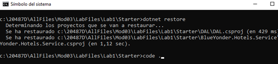
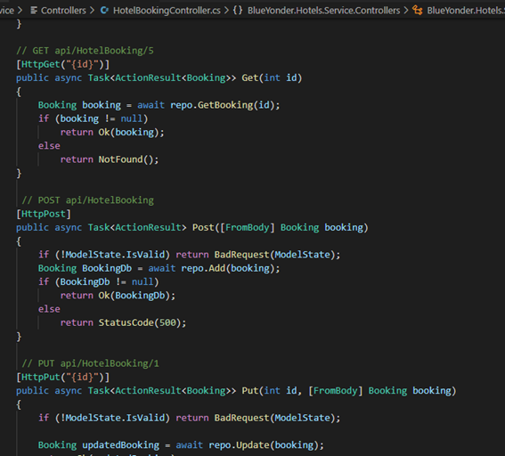
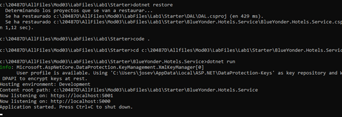
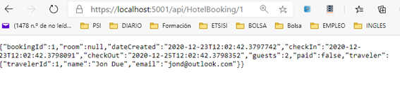
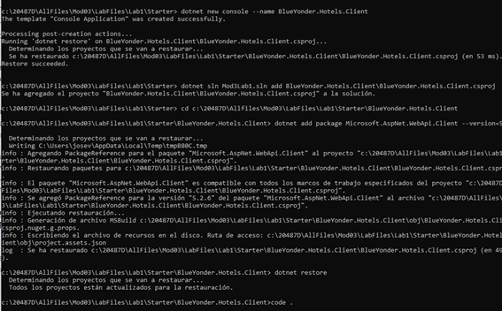
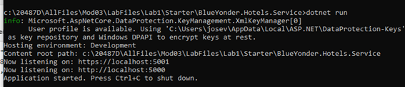
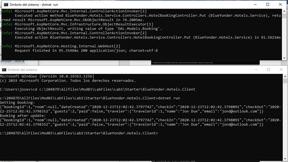

# 20487D_MOD03_LAK_BlueYonderHotel

JOSE VICENTE TEJERO - 23/12/2020

RESUMEN
Creating and Consuming ASP.NET Core Web APIs 
Create a controller class
Add a controller class
Add action methods to the controller for GET, POST, and PUT

Use the API from a browser
Create a client
Create a console project and add a reference to System.Net.Http
Use HttpClient to call the GET and PUT actions of the controller

PROBLEMAS
No
20487D_MOD03_LAK

 

**Module 3: Creating and Consuming ASP.NET Core Web APIs**

**Lab: Creating an ASP.NET Core Web API**

 

### Exercise 1: Create a controller class

#### Task 1: Add a controller class

 

 

 

### Exercise 2: Use the API from a browser

#### Task 1: Use a browser to access the GET action

 

Levantamos el servicio:

 

 

Comprobamos que aparece la reserva:

 

 

 

### Exercise 3: Create a client

 

#### Task 1: Create a console project and add a reference to System.Net.Http

 

 

 

#### Task 2: Use HttpClient to call the GET and PUT actions of the controller

 

Levantamos el servidor:

 

 

 

Ejecutamos el cliente y comprobamos la respuesta del GET y del PUT:

 

